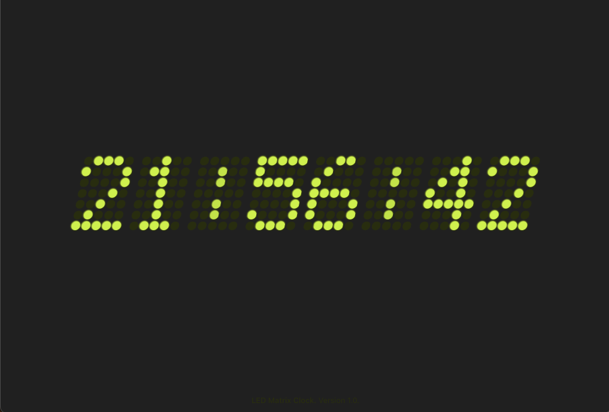

# Web LED Matrix Clock
Just a simple web based digital clock inspired by LED Matrix while looking for a simple, ad-free, full-window clock for my studio.

The code is written in HTML, CSS and VueJS 3.x with TypeScript support.



## Usage
```
git clone https://github.com/SingHar/LED-Matrix-Clock
cd LED-Matrix-Clock
npm install
npm run dev
```

## Properties
The `Clock` vue component has following properies

1. `led-type`: 'round' for rounded LEDs, anything else for square LEDs
2. `slant`: Slant of the digits in degrees.

For example:

`<Clock slant='11' />`
This will generate 11 degrees slanted digits with square LEDs.

`<Clock led-type='round' />` 
This will generate straight digits with rounded LEDs.

`<Clock led-type='round' slant='11' />` 
This will generate 11 degrees slanted digits with rounded LEDs.

